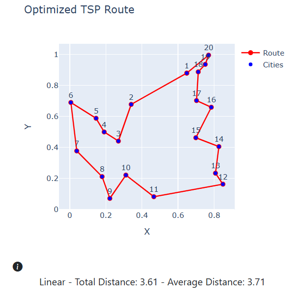
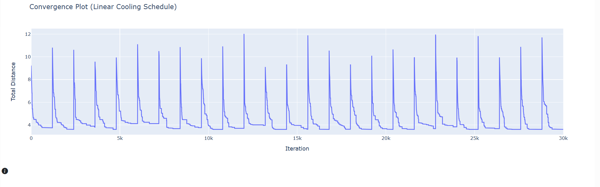
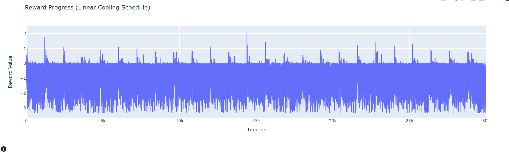

# HyVis: TSP Visualisation Tool

An interactive tool for solving the Travelling Salesman Problem (TSP) using a hybrid approach combining Reinforcement Learning (RL) and Simulated Annealing (SA).

## 🚀 Overview
This project explores how optimisation techniques can be combined to improve solution quality for complex problems like TSP. It also provides real-time visualisation to help understand how solutions evolve.

## 🧠 Key Concepts
- Reinforcement Learning (utility-based agent)
- Simulated Annealing (cooling schedules)
- Exploration vs Exploitation
- Heuristic optimisation

## 🛠 Tech Stack
- Python
- NumPy
- Plotly
- Dash

## 🧩 Features
- Interactive Travelling Salesman Problem (TSP) visualisation
- Hybrid optimisation approach combining Reinforcement Learning and Simulated Annealing
- Multiple cooling schedules:
  - Geometric
  - Linear
  - Lundy-Mees
- Real-time performance analytics:
  - Convergence plots
  - Reward progression
  - Heuristic utilisation and effectiveness
- Interactive dashboard with parameter tuning and explanatory tooltips ("i" buttons)

## 📁 Project Files
- `GirijaD_20597330_HyVis_Report.pdf` — Full dissertation
- `Final_code_Girija_dissertation(1).ipynb` — Implementation

## ▶️ Running the Project
Instructions coming soon (code currently in notebook format).

## 📊 Experimental Results
### Test Configuration
- Cities: 20
- Episodes: 25
- Steps: 1200
- Learning Rate: 0.1
- Discount Factor: 0.95
- Exploration Rate: 0.15
- Initial Temperature: 2
- Decay Rate: 0.97
  
## 📊 Sample Output (Linear Cooling)
### Optimised Route

### Convergence Behaviour

### Reward Progression

### 📌 Observations
- Linear cooling showed slightly better performance under moderate complexity.
- All cooling schedules converged to similar-quality solutions.
- Heuristic utilisation remained balanced (~50/50).
- Reward progression showed stable learning behaviour.
  
## 📌 Note
Similar analyses were conducted for Geometric and Lundy-Mees cooling schedules, showing comparable convergence behaviour with slight performance variations.
Also,this project is part of an MSc dissertation and is shared for demonstration purposes.

## 📌 Future Improvements
- Refactor code into modular Python files
- Improve scalability for larger datasets
- Enhance UI and user interaction
